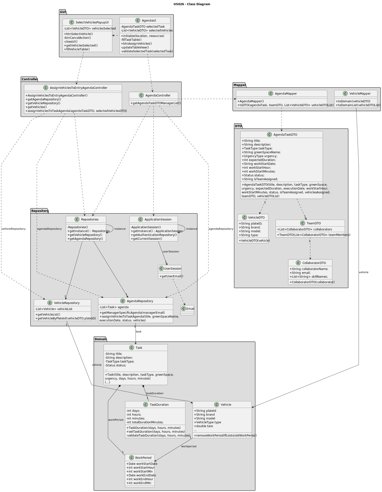

# US026 - Assign one or more vehicles to an entry in the Agenda

## 3. Design - User Story Realization

### 3.1. Rationale

| Interaction ID                                                                | Question: Which class is responsible for...                  | Answer                                | Justification (with patterns)                                                                                 |
|:------------------------------------------------------------------------------|:-------------------------------------------------------------|:--------------------------------------|:--------------------------------------------------------------------------------------------------------------|
| Step 1: Asks to assign one or more vehicles to an entry in the Agenda		       | 	... interacting with the actor?                             | AgendaUI                              | Pure Fabrication: there is no reason to assign this responsibility to any existing class in the Domain Model. |
| 			  		                                                                       | 	... coordinating the US on showing agenda to the actor?     | AgendaController                      | Controller                                                                                                    |
|                                                                               | ... coordinating the completion of the US?                   | AssignVehiclesToEntryAgendaController | Controller                                                                                                    |
| 			  		                                                                       | ... knowing the user using the system?                       | UserSession                           | IE: cf. A&A component documentation.                                                                          |
| Step 2: Shows the list of tasks in the agenda and asks to select one  		      | 	... obtaining the manager agenda list?						                | AgendaRepository                      | Information Expert: AgendaRepository knows all the Agenda tasks and contains all task Agenda instances        |
|                                                                               | ... mapping Agenda list into Agenda DTO list?                | AgendaMapper                          | Pure Fabrication: AgendaMapper has the responsibility of converting a domain object into a DTO object.        |
|                                                                               | ... displaying the Agenda DTO list                           | AgendaUI                              | Pure Fabrication                                                                                              |
| Step 3: Selects a task  		                                                    | 	... validating the selected data?                           | AgendaUI                              | Pure Fabrication                                                                                              |
|                                                                               | ... temporarily keeping the selected task?                   | AgendaUI                              | Pure Fabrication                                                                                              |
| Step 4: Shows the popup with the list of vehicles  		                         | 	...opening the popup scene?                                 | AgendaUI                              | Pure Fabrication                                                                                              |
| Step 5: Shows the list of vehicles and asks to select the vehicles needed  		 | 	.... obtaining the list of vehicles?                        | VehicleRepository                     | Information Expert: VehicleRepository knows all Vehicles and contains all vehicles instances                  |
|                                                                               | ... mapping list of vehicles into vehicle DTO list?          | VehicleMapper                         | Pure Fabrication: VehicleMapper has the responsibility of converting a domain object into a DTO object.       |
| 		                                                                            | 	.... displaying the vehicle DTO list to the actor?          | SelectVehiclesPopupUI                 | Pure Fabrication                                                                                              |
| Step 6: Selects a vehicle  		                                                 | 		... validating the selected data?					                     | SelectVehiclesPopupUI                 | Pure Fabrication                                                                                              |              
|                                                                               | ... temporarily keeping input data?                          | SelectVehiclesPopupUI                 | Pure Fabrication                                                                                              |
| Step 7: Sends the list of selected vehicles to main UI  		                    | 	... sending the selected vehicles back to main UI?          | SelectVehiclesPopupUI                 | Pure Fabrication                                                                                              | 
| Step 8: Adds the selected vehicles to the selected entry of Agenda.		  		     | 	... obtaining all the domain Vehicle object?                | VehicleRepository                     | Information Expert: VehicleRepository knows all vehicles and contains all vehicles instances                  | 
| 			  		                                                                       | 	... assign all vehicles to the task?                        | Task                                  | Information Expert: Task has the necessary methods required to assign its vehicles                            | 
|                                                                               | ... know which Agenda task should have its vehicles assigned | AgendaRepository                      | Information Expert: AgendaRepository aggregates Task instances and validates duplicate records                |
|                                                                               | ... add the work period to the assigned vehicles?            | Vehicle                               | Information Expert: Vehicle has the necessary methods required to add work periods                            |
| Step 9: Display operation success  		                                         | 	... informing operation success?                            | AgendaUI                              | Pure Fabrication                                                                                              | 

### Systematization ##

According to the taken rationale, the conceptual classes promoted to software classes are:

* Task
* Vehicle

Other software classes (i.e. Pure Fabrication) identified:

* AgendaUI
* SelectVehiclesPopupUI
* AgendaController
* AssignVehiclesToEntryAgendaController
* AgendaMapper
* VehicleMapper
* UserSession
* AgendaRepository
* VehicleRepository
* WorkPeriod

## 3.2. Sequence Diagram (SD)

### Full Diagram

This diagram shows the full sequence of interactions between the classes involved in the realization of this user story.

### Ref: SD_managerSpecificAgendaDTO

### Ref: SD_obtainManagerAgendaTaskList

### Ref: SD_getVehicleListDTO

### Ref: SD_getVehicleListDomainObject

## 3.3. Class Diagram (CD)

