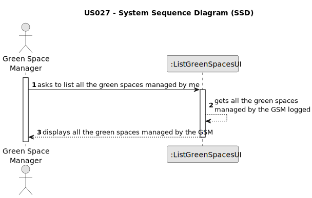

# US027 - List green spaces

## 1. Requirements Engineering

### 1.1. User Story Description

As a GSM, I need to list all green spaces managed by me.

### 1.2. Customer Specifications and Clarifications 

**From the specifications document:**

>	Green spaces for collective use can vary significantly in dimensions and available amenities.
 
**From the client clarifications:**

> **Question:** 
>
> **Answer:** 

### 1.3. Acceptance Criteria

* **AC1:** All required fields must be filled in.
* **AC2:** The list of green spaces must be sorted by size in descending order. The sorting algorithm to be used by the application
  must be defined through a configuration file. At least two sorting
  algorithms should be available.

### 1.4. Found out Dependencies

* There is a dependency on "US020 - Register a green space" as there must be at least one green space registered in the system to be listed.

### 1.5 Input and Output Data

**Input Data:**

* Typed data:
    * n/a
* Selected data:
    * n/a 

**Output Data:**

* List of green spaces managed by the GSM.

### 1.6. System Sequence Diagram (SSD)

**_Other alternatives might exist._**

#### Alternative One

### 1.7 Other Relevant Remarks

* n/a