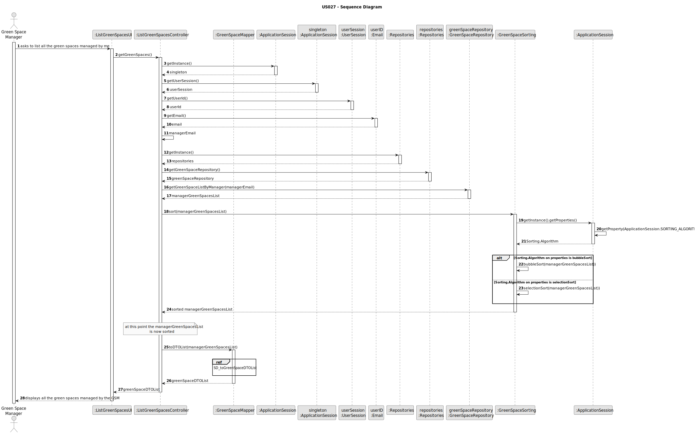

# US027 - List green spaces

## 3. Design - User Story Realization

### 3.1. Rationale

| Interaction ID                                               | Question: Which class is responsible for...                 | Answer                    | Justification (with patterns)                                                                                                      |
|:-------------------------------------------------------------|:------------------------------------------------------------|:--------------------------|:-----------------------------------------------------------------------------------------------------------------------------------|
| Step 1: Asks to list all the green spaces managed by me  		  | 	... interacting with the actor?                            | ListGreenSpacesUI         | Pure Fabrication: there is no reason to assign this responsibility to any existing class in the Domain Model.                      |
| 			  		                                                      | 	... coordinating the US?                                   | ListGreenSpacesController | Controller                                                                                                                         |
| 			  		                                                      | ... knowing the user using the system?                      | UserSession               | IE: cf. A&A component documentation.                                                                                               |
| Step 2: Displays all the green spaces managed by the GSM  		 | 	... obtaining the green space list managed by user?						  | GreenSpaceRepository      | Information Expert: GreenSpaceRepository knows all the Green Spaces and contains all green space instances                         |
|                                                              | ... knowing which algorithm must be used to sort?           | ApplicationSession        | Information Expert: ApplicationSession reads the properties from the configuration file, specifying the sort algorithm to be used. |
|                                                              | ... applying the algorithm to the green space manager list  | GreenSpaceSorting         | Information Expert: GreenSpaceSorting has the necessary methods to apply the specific sort algorithm                               |
|                                                              | ... mapping Green space list into green space DTO list?     | GreenSpaceMapper          | Pure Fabrication: GreenSpaceMapper has the responsibility of converting a domain object into a DTO object.                         |
|                                                              | ... displaying the sorted green space DTO list to the user? | ListGreenSpacesUI         | Pure Fabrication                                                                                                                   |

### Systematization ##

According to the taken rationale, the conceptual classes promoted to software classes are:

* GreenSpace

Other software classes (i.e. Pure Fabrication) identified:

* ListGreenSpacesUI
* ListGreenSpacesController
* GreenSpaceRepository
* GreenSpaceMapper
* GreenSpaceSorting
* UserSession
* ApplicationSession

## 3.2. Sequence Diagram (SD)

### Full Diagram

This diagram shows the full sequence of interactions between the classes involved in the realization of this user story.

### Ref: SD_toGreenSpaceDTOList

## 3.3. Class Diagram (CD)

