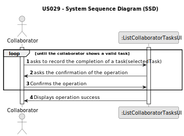

# US028 - Consult tasks assigned between two dates

## 1. Requirements Engineering

### 1.1. User Story Description

As a Collaborator, I wish to consult the tasks assigned to me between two dates

### 1.2. Customer Specifications and Clarifications 

**From the specifications document:**

> These tasks can be regular (e.g. pruning trees) or occasional (e.g. repairing a broken
equipment). They may also require a multidisciplinary team and the length
of the task can vary from a few minutes (e.g. replacing a light bulb) to weeks
(e.g. installing an irrigation system).

> The Agenda is made up of entries that relate to a task (which was previously in the To-Do List),
the team that will carry out the task, the vehicles/equipment assigned to
the task, expected duration, and the status (Planned, Postponed, Canceled,
Done).

**From the client clarifications:**

> **Question:** 
>
> **Answer:** 

### 1.3. Acceptance Criteria

* **AC1:** All required fields must be filled in.
* **AC2:** The list of tasks must be sorted by date
* **AC3:**  The Collaborator should be able to filter the results by the status of the task

### 1.4. Found out Dependencies

* There is a dependency on "US003 - Register a collaborator" as there must be at least one Collaborator created to request the tasks it is assigned to.
* There is a dependency on "US005 - Generate a Team" as the collaborator must be assigned to a team before it can be assigned to any task.
* There is a dependency on "US021 - Add new entry to the To-Do List" as there must have been at least one entry in the To-Do List before it was in the agenda.
* There is a dependency on "US022 - Add new entry to the Agenda" as there must be at least one task in the agenda for the team to be assigned to.
* There is a dependency on "US023 - Assign team to task" as the team the collaborator is assigned, must be assigned to a task before the collaborator can list it.

### 1.5 Input and Output Data

**Input Data:**

* Typed data:
    * initialDate
    * finalDate
	
* Selected data:
    * n/a

**Output Data:**

* List of tasks assigned to the Collaborator

### 1.6. System Sequence Diagram (SSD)

**_Other alternatives might exist._**

#### Alternative One

### 1.7 Other Relevant Remarks

* n/a