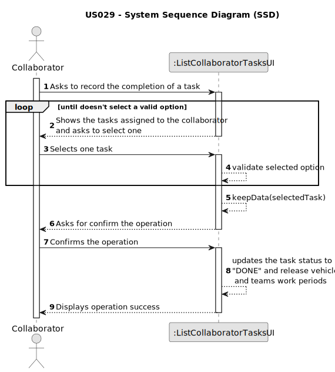

# US029 - Record the completion of a task

## 1. Requirements Engineering

### 1.1. User Story Description

As a Collaborator, I want to record the completion of a task.

### 1.2. Customer Specifications and Clarifications

**From the specifications document:**

>	The management of green areas for public use requires the timely management and completion of multiple tasks throughout the year.

>	The Agenda is made
up of entries that relate to a task (which was previously in the To-Do List),
the team that will carry out the task, the vehicles/equipment assigned to
the task, expected duration, and the status (Planned, Postponed, Canceled,
Done).

**From the client clarifications:**

> **Question:** Can a collaborator mark a task as "done" only if it is in the "planned" status?
>
> **Answer:** It depends on the status set your team decide to have/use. But if you consider only status refered in the text and in the forum my answer would be, yes, just the "Planned" status can be changed to "Done".

> **Question:** The collaborator should be able to change the status of any task or only tasks assigned to him?
>
> **Answer:** yes

> **Question:** When a collaborator records a task, it should be asked for any observations regarding the completed task?
>
> **Answer:** Not mandatory

> **Question:** The collaborator can see what type of entrys? Like what status can he filter ? Can he see canceled Entry's?
>
> **Answer:** The ones assigned to him.
He can filter by the different values the status of the status, like planned, executed, canceled ...

### 1.3. Acceptance Criteria

* **AC1:** A task must be selected before recording as completed.
* **AC2:** The tasks showing to the collaborator, are only the ones assigned to him.
* **AC3:** If the task recorded as completed had a team and/or vehicles assigned, both will be released from that work period.
* **AC4:** Only tasks with status Planned can be set as completed.

### 1.4. Found out Dependencies

* There is a dependency on "US003 - Register a collaborator" as there must be at least one collaborator created in the system for him to be assigned to a task.
* There is a dependency on "US021 - Add new entry in the To-Do List" as the task must have first been created in the To-Do List before it can be added to the agenda.
* There is a dependency on "US022 - Add new entry in the Agenda" as the task must have already been added to the agenda before it can be assigned to a team.

### 1.5 Input and Output Data

**Input Data:**

* Typed data:
  * n/a

* Selected data:
  * a task from the collaborator agenda

**Output Data:**

* Success of the operation

### 1.6. System Sequence Diagram (SSD)

### 1.7 Other Relevant Remarks

There is no other relevant remarks for this User Story.