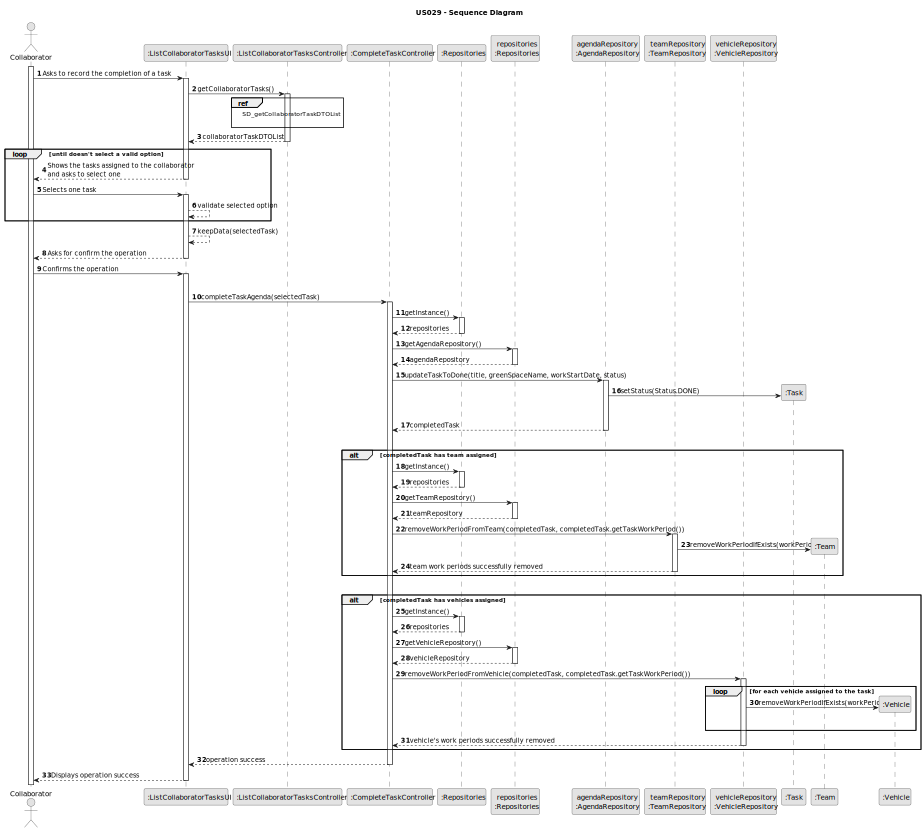
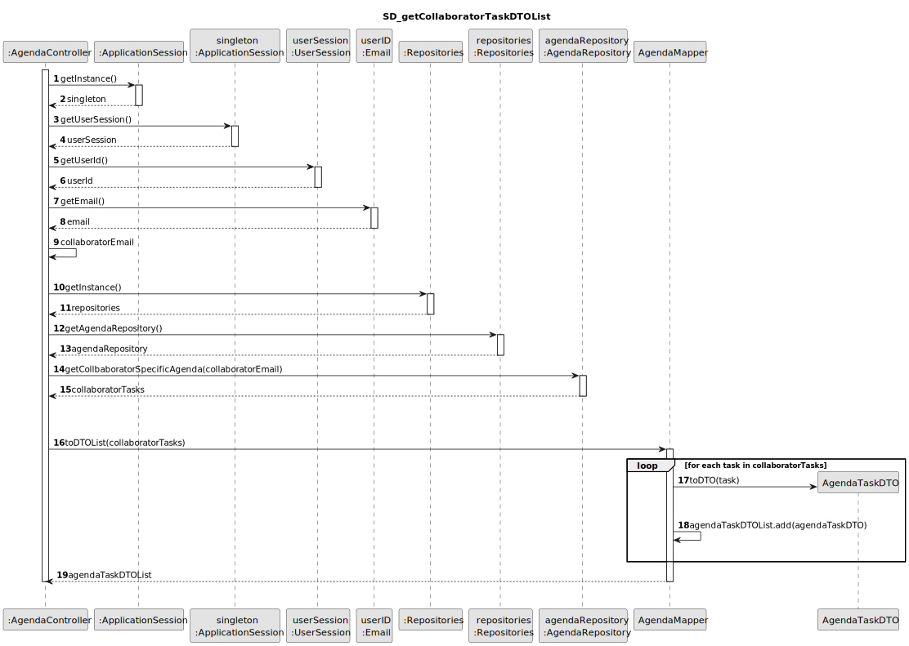
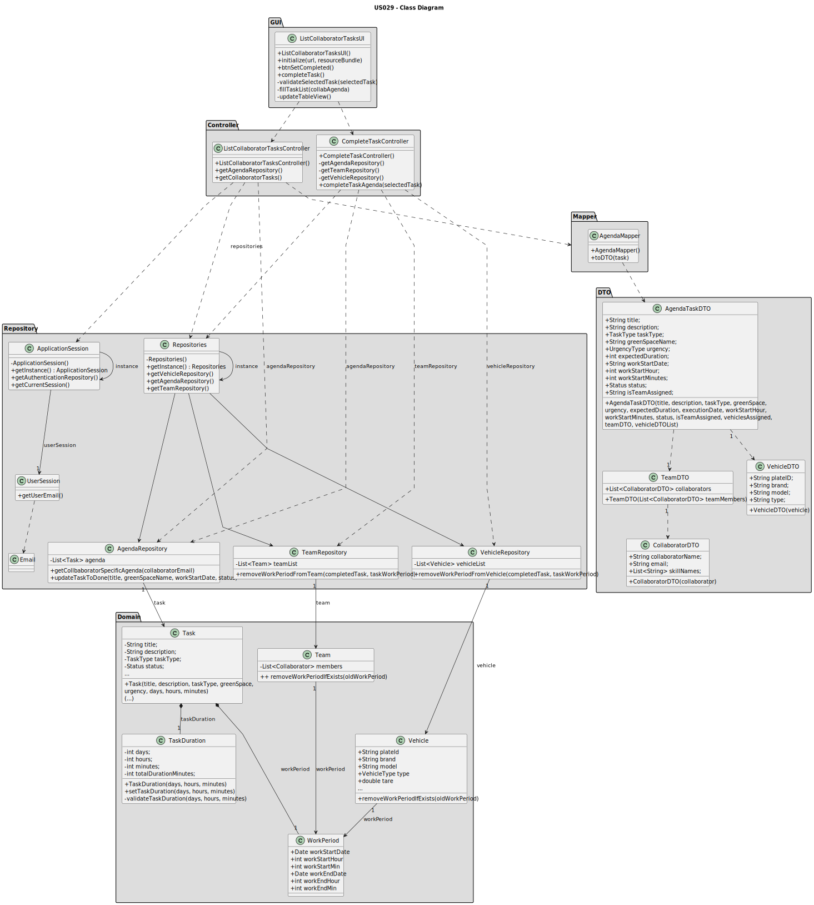

## 3. Design - User Story Realization

### 3.1. Rationale

| Interaction ID                                                                  | Question: Which class is responsible for...             | Answer                          | Justification (with patterns)                                                                                 |
|:--------------------------------------------------------------------------------|:--------------------------------------------------------|:--------------------------------|:--------------------------------------------------------------------------------------------------------------|
| Step 1: Asks to record the completion of a task		                               | 	... interacting with the actor?                        | ListCollaboratorTasksUI         | Pure Fabrication: there is no reason to assign this responsibility to any existing class in the Domain Model. |
| 			  		                                                                         | 	... coordinating the US on showing tasks to the actor? | ListCollaboratorTasksController | Controller                                                                                                    |
|                                                                                 | ... coordinating the completion of the US?              | CompleteTaskController          | Controller                                                                                                    |
| 			  		                                                                         | ... knowing the user using the system?                  | UserSession                     | IE: cf. A&A component documentation.                                                                          |
| Step 2: Shows the tasks assigned to the collaborator and asks to select one  		 | 	... obtaining the collaborator task list?						        | AgendaRepository                | Information Expert: AgendaRepository knows all the Agenda tasks and contains all task Agenda instances        |
|                                                                                 | ... mapping collaborator task list into DTO list?       | AgendaMapper                    | Pure Fabrication: AgendaMapper has the responsibility of converting a domain object into a DTO object.        |
|                                                                                 | ... displaying the collaborator task DTO list?          | ListCollaboratorTasksUI         | Pure Fabrication                                                                                              |
| Step 3: Selects a task  		                                                      | 	... validating the selected data?                      | ListCollaboratorTasksUI         | Pure Fabrication                                                                                              |
|                                                                                 | ... temporarily keeping the selected task?              | ListCollaboratorTasksUI         | Pure Fabrication                                                                                              |
| Step 4: Asks for confirm the operation 		                                       | 	...displaying the confirmation message?                | ListCollaboratorTasksUI         | Pure Fabrication                                                                                              |
| Step 8: Confirms the operation		  		                                            | 	... knowing the task object to be set as completed?    | AgendaRepository                | Information Expert: AgendaRepository knows all agenda entries and contains all agenda task instances          | 
| 			  		                                                                         | 	... set the task status to complete?                   | Task                            | Information Expert: Task has the necessary methods required to set the status of task to complete             | 
|                                                                                 | ... knowing which team needs to be updated?             | TeamRepository                  | Information Expert: TeamRepository aggregates Team instances and knows all teams                              |
|                                                                                 | ... removing the work period of the assigned team?      | Team                            | Information Expert: Team has the necessary methods required to remove work periods from team assigned         |
|                                                                                 | ... knowing which vehicles needs to be updated?         | VehicleRepository               | Information Expert: VehicleRepository aggregates Vehicles instances and knows all vehicles information        |
|                                                                                 | ... removing the work period of the assigned vehicles?  | Vehicle                         | Information Expert: Vehicle has the necessary methods required to remove work periods from vehicles           |
| Step 9: Display operation success                                               | ... informing operation success?                        | ListCollaboratorTasksUI         | Pure Fabrication                                                                                              |

### Systematization ##

According to the taken rationale, the conceptual classes promoted to software classes are:

* Task
* Team
* Vehicle

Other software classes (i.e. Pure Fabrication) identified:

* ListCollaboratorTasksUI
* ListCollaboratorTasksController
* CompleteTaskController
* UserSession
* AgendaRepository
* TeamRepository
* VehicleRepository
* AgendaMapper
* AgendaTaskDTO

## 3.2. Sequence Diagram (SD)

### Full Diagram

This diagram shows the full sequence of interactions between the classes involved in the realization of this user story.

### Ref: SD_getCollaboratorTaskDTOList

## 3.3. Class Diagram (CD)

